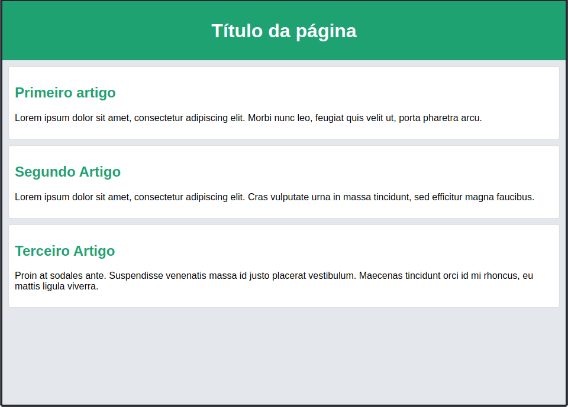

# CSS: Flexbox

## O que vamos aprender?
Olá, Tryber!

No dia de hoje nós iremos aprender a utilizar uma das ferramentas mais poderosas para a criação de layouts em CSS: o **flexbox**!

## Você será capaz de?
Ao final do conteúdo de hoje, você será capaz de aplicar o *flexbox* nos seus sites e desenvolver os mais diversos layouts a partir dessa ferramenta, o que eliminará boa parte das dificuldades que você enfrentou até o momento quanto ao alinhamento e à centralização do conteúdo!

## Porque isso é importante?
Antes da implementação da versão 3 do CSS, as pessoas desenvolvedoras precisavam se virar nos 30 para deixar os seus sites com a aparência desejada usando a propriedade `display` com atributos que você já aprendeu: `float`, `inline-block`, `block`. Ou mesmo a propriedade `position`, em algumas situações bem específicas. 

Mas como você já sabe, criar um layout bem feito apenas com essas propriedades não é lá a coisa mais fácil do mundo. Existem tarefas que se tornam um pesadelo se apenas esses recursos estiverem disponíveis, dentre as quais:
-   Alinhar *verticalmente* um bloco de conteúdo *no centro* do bloco que o contém;
-   Fazer todos os elementos descendentes de um outro elemento ocuparem a mesma quantidade de espaço considerando a largura e altura disponíveis;
-   Fazer todas as colunas de um conteúdo possuírem a mesma altura mesmo tendo conteúdos de tamanhos diferentes.
-  Possibilitar com muito menos dor de cabeça a criação de layouts responsivos, o que você aprenderá mis adiante!

Com a chegada do CSS3, foi introduzido um modelo que acabou de vez com esse problema: o *Flexible Boxes*, ou **flexbox**. Com ele, tornou-se possível desenvolver layouts com muito mais facilidade e precisão: ele organiza os elementos de uma forma previsível e que pode ser facilmente adaptada para diferentes browsers e tamanhos de tela.

Vamos ver com mais detalhes todas as possibilidades maravilhosas trazidas pelo *flexbox*?
 
## Conteúdos

Para conseguir entender de verdade como funciona o *flexbox*,  primeiro vamos relembrar o comportamento padrão de uma página HTML, considerando o seguinte código:

    <body>
      <header>
        <h1>Título da página</h1>
      </header>
      <section>
        <article>
          <h2>Primeiro artigo</h2>
          
Lorem ipsum dolor sit amet, consectetur adipiscing
          elit. Morbi nunc leo, feugiat quis velit ut, porta
          pharetra arcu.

        </article>
        <article>
	      <h2>Segundo Artigo</h2>
	      
Lorem ipsum dolor sit amet, consectetur adipiscing
	      elit. Cras vulputate urna in massa tincidunt, sed
          efficitur magna faucibus.

	    </article>
	    <article>
	      <h2>Terceiro Artigo</h2>
	      
Proin at sodales ante. Suspendisse venenatis massa id
	      justo placerat vestibulum. Maecenas tincidunt orci id mi
	      rhoncus, eu mattis ligula viverra.

	    </article>
	  </section>
	</body>

Ao rodar esse código no browser utilizando o layout padrão do HTML, a sessão ficará abaixo do header, todos os artigos ficarão abaixo um do outro e os parágrafos ficarão abaixo dos h2.

Para exemplificar, vejamos como fica a página com o layput padrão (após algumas estilizações no css pra deixar com a cara da Trybe :wink:):

